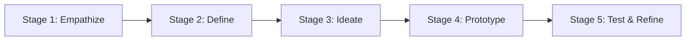
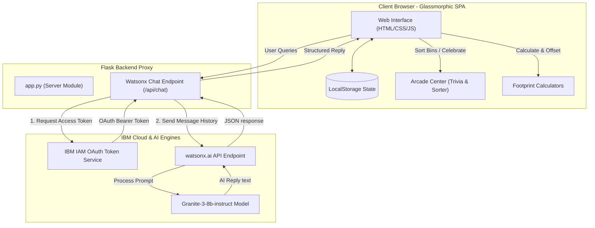

# 🌿 EcoGranite - AI Household Sustainability Advisor

Developed by **[Dhanish Ladwani](https://github.com/dhanish0711/)** 🚀

---

## 🛡️ Technologies Used

[](https://www.python.org/)
[](https://flask.palletsprojects.com/)
[](https://developer.mozilla.org/en-US/docs/Glossary/HTML5)
[](https://developer.mozilla.org/en-US/docs/Web/CSS)
[](https://developer.mozilla.org/en-US/docs/Web/JavaScript)
[](https://www.ibm.com/watsonx)
[](https://sdgs.un.org/goals/goal12)
[](https://sdgs.un.org/goals/goal13)

---

## 📝 Project Overview

**EcoGranite** is a premium, high-fidelity single-page web application (SPA) designed to empower households to audit, track, and optimize their ecological footprints. Aligning directly with **UN Sustainable Development Goal 12 (Responsible Consumption and Production)** and **Goal 13 (Climate Action)**, EcoGranite acts as an interactive sustainability advisor. It integrates the **IBM Granite-3-8b-instruct** model using watsonx.ai REST APIs to generate custom action plans, analyze home appliances, and teach recycling rules. 🌐

Developed as a core showcase for the **1M1B AI for Sustainability Virtual Internship** 🎓.

---

## 🏆 1M1B Virtual Internship & Design Thinking Alignment

To align fully with the evaluation rubric of the 1M1B Virtual Internship, this project incorporates the required project design principles and the 5-stage Design Thinking framework.

### ❓ The Four Core Sustainability Questions

*   **What problem are you solving?** 🌍
    We are addressing the lack of actionable, domestic-scale resource management toolsets. Individual households are responsible for a significant share of global emissions and municipal solid waste. Improper waste sorting leads to organic materials decaying anaerobically in landfills, releasing methane (a greenhouse gas 28x more potent than CO2).
*   **Who is affected by this problem?** 👥
    - **Local Communities**: Face landfill expansions, soil contamination, and resource strain.
    - **Households**: Face rising utility costs and carbon footprints.
    - **The Global Environment**: Affected by rising carbon emissions leading to climate instability.
*   **Why is AI needed?** 🤖
    Standard carbon calculators are static, dry forms that offer no feedback loops. By using **IBM Granite**, we automate personalized audits, summarize complex electrical loads, and generate dynamic weekly eco-challenges that adapt to user scores. This creates engaging, conversational instruction at scale.
*   **How does your solution create impact?** ⚡
    - **Environmental**: Diverting food waste to compost setups reduces methane emissions.
    - **Economic**: Reducing phantom standby loads and upgrading to LED configurations lowers utility bills.
    - **Social**: Gamified arcade games and checklists foster local green habits.

### 📁 Project Classification
EcoGranite is classified as a combined **Conversational AI Assistant** 🤖 and **Decision-Support System** 📊.

### 🎯 SDG Problem Statement
> **How might we** use AI to guide domestic resource auditing, goal planning, and gamified sorting education **so that** households and local communities **can become more sustainable** in their daily consumption and waste behaviors? ♻️

---

### ⚙️ Role of AI & Allowed Components
EcoGranite integrates advanced LLM prompting techniques:
*   **Prompt Engineering** 🧠: Employs rigorous system prompts to override Granite disclaimers and assume the persona of *EcoGranite*, an authoritative advisor.
*   **IBM Granite Models** 🔮: Calls `ibm/granite-3-8b-instruct` for structural text output and diagnostic audits.
*   **Information Retrieval & Summarization** 📚: Reads calculated data arrays and translates them into summarized, actionable guides.
*   **Entity Extraction** 🔍: Parses raw outputs in JSON formats to power the dynamic trivia generator.

---

### 💡 Design Thinking Showcase



*   **Stage 1: Empathize** 🤝
    *   *Observations*: Households find carbon footprint terms confusing. Sorting recyclables feels tedious, and users often do not realize how small leaks (e.g. dripping faucets) or standby loads affect their bills.
*   **Stage 2: Define** 🎯
    *   *Problem Statement*: Households lack an engaging, centralized tool to track footprints, resolve sorting confusion, and receive active, structured advice.
    *   *Target Users*: Environmentally-conscious residents, students, and families looking to lower household carbon impacts.
*   **Stage 3: Ideate** 💭
    *   *Solution Idea*: Create a dashboard connecting interactive footprint scoring, a waste-sorting arcade game (Eco-Sorter) to address sorting confusion, and an direct IBM Granite prompt proxy to audit specific appliances.
*   **Stage 4: Prototype** 🔧
    *   *Implementation*: Programmed a Flask application serving a responsive HTML5 UI styled with CSS glassmorphism, animated emission breakdown bar charts, and a client-side JavaScript router.
*   **Stage 5: Test & Refine** 🧪
    *   *Feedback & Improvements*: Replaced default browser-native alerts (which interrupted gameplay and forms) with custom floating CSS toast banners. Added a secure browser `localStorage` credentials system to protect user keys.

---

## 🎨 System Architecture & Data Flow

The diagram below details the data flow between the glassmorphic SPA frontend, the Python/Flask backend proxy, and the remote IBM cloud services:



---

## 📁 Project Structure

```text
EcoGranite/
│
├── static/
│   ├── css/
│   │   └── style.css          # Glassmorphic UI theme, colors, keyframes, transitions
│   └── js/
│       └── app.js             # Client router, game states, calculation formulas, storage
│
├── templates/
│   └── index.html             # Single Page Application HTML structure, form grids, cards
│
├── .env                       # Local secrets (Ignored by git - API Keys, project IDs)
├── .env.example               # Secret configuration template
├── .gitignore                 # GitHub ignore config (excludes venv, .env, __pycache__)
├── app.py                     # Flask server proxy, REST routing, and simulated mock fallback
├── requirements.txt           # Python backend dependencies
└── test_watsonx.py            # Diagnostic script to test watsonx connections independently
```

---

## ✨ Feature Showcase

### 1. Sustainability Index & Carbon Assessment 📊
- **Dynamic Assessment**: Captures energy (kWh/month), water (liters/month), waste (kg/week), and driving habits (km/month) to calculate:
  - **Sustainability Index (0-100)**: Visualized on a custom circular progress dial with interactive glows (green for high efficiency, yellow for moderate, red for high footprint).
  - **Carbon Footprint (tons CO2e/year)**: Calculated using local emissions coefficients and shown with compliance comparisons.
- **Source Breakdown Bar Chart**: Segments carbon emissions dynamically into Electricity, Cooking, Water, Waste, and Transportation, complete with hover scaling and sliding stripe animations.

### 2. Multi-Accent Theme Customizer 🎨
- Toggle themes instantly via header controls:
  - **Forest Emerald (Green)** 🌲: Traditional nature-first theme.
  - **Cyberpunk Ocean (Blue/Cyan)** 🌊: High-tech grid neon theme.
  - **Solar Amber (Gold/Orange)** ☀️: Clean solar energy amber theme.
- Selections are stored locally to maintain style preferences upon page reloads.

### 3. Net-Zero Goal Planner 🎯
- Set target emissions.
- Simulate offsets by adjusting virtual tree planting sliders (each tree offsets 22 kg CO2/year) and installing virtual solar panels (offsets ~1.5 tons CO2/year).
- Unlocks the glowing green **Net-Zero Hero** achievement badge when net emissions match or drop below targets. 🌳

### 4. Eco-Sorter Conveyor Game 🎮
- An arcade-style sorting game to learn recycling rules.
- Items (e.g. *Apple Core* 🍎, *Dead Batteries* 🔋, *Cardboard Boxes* 📦) slide in on a conveyor belt card.
- Route items to composting, recycling, landfill, or e-waste. Correct answers award points and trigger glowing particle bursts, while wrong answers deduct lives and show detailed explanations.

### 5. AI Advisor Chat 🤖
- Interact with your **IBM Granite Advisor** using custom templates.
- Features quick-prompt chips to start conversations about summer hacks, home compost setups, or SDG mappings.
- Custom **AI Appliance Audits** and **AI Weekly Challenges** are generated dynamically.

---

## 🌎 UN SDG Mapping

EcoGranite directly addresses targets in the UN Sustainable Development Goals (SDG) roadmap:

*   **SDG 12.3 (Reduce Food Waste)** 🍂: Encourages composting organic wet waste, which diverts decomposition from landfill landfills where anaerobic decay releases methane.
*   **SDG 12.5 (Substantially Reduce Waste Generation)** ♻️: Teaches sorting compostable, recyclable, landfill, and hazardous electronic waste through the conveyor mini-game.
*   **SDG 12.8 (Promote Sustainable Lifestyles)** ⏱️: Habit-checklist streaks encourage low-carbon daily actions (short showers, cutting phantom standby loads, avoiding single-use plastics).
*   **SDG 13.3 (Build Knowledge to Meet Climate Change)** 📚: Dynamic AI quizzes reinforce environmental science concepts.

---

## 🧠 watsonx.ai System Prompt Engineering

To govern Granite's responses, the Flask server overrides the context with a predefined system instructions module, keeping answers tailored, authoritative, and helpful:

```python
system_prompt = {
    "role": "system",
    "content": (
        "You are EcoGranite, an expert Household Sustainability Advisor. "
        "Your role is to help users reduce their carbon footprint, save energy, "
        "minimize waste (by recycling and composting), and conserve water. "
        "Provide highly actionable, encouraging, and clear household optimization advice. "
        "Do not output disclaimers saying you are not an advisor or cannot access real-time data. "
        "Speak with authority as the EcoGranite advisor."
    )
}
```

---

## 🔒 Responsible AI Standards

EcoGranite complies with major Responsible AI boundaries:
1.  **Transparency** 📢: Clearly indicates to the user when replies are generated by IBM Granite vs. simulation templates.
2.  **Privacy** 🔑: Stores watsonx.ai credentials in `localStorage` inside the user's browser, preventing keys from printing in backend server console logs.
3.  **Fairness** ⚖️: Audits are designed for various living configurations (apartments, urban complexes, suburban properties) rather than assuming single-family households.
4.  **Safety** ⚠️: Generates cautionary advice when users ask about composting toxic materials or handling high-voltage household wiring.

---

## ⚙️ Setup & Installation

### 1. Clone the Repository 📂
```bash
git clone https://github.com/dhanish0711/EcoGranite.git
cd EcoGranite
```

### 2. Configure Credentials 🔑
Duplicate `.env.example` to create a `.env` file:
```env
WATSONX_APIKEY=your_ibm_api_key
WATSONX_PROJECT_ID=your_watsonx_project_id
WATSONX_SERVICE_URL=https://us-south.ml.cloud.ibm.com
```
*Note: If credentials are left blank, the app loads in a comprehensive local Simulation Mode.*

### 3. Install & Run 🚀
```bash
# Create and activate virtual environment
python -m venv venv
.\venv\Scripts\Activate.ps1   # On Windows (PowerShell)
# source venv/bin/activate    # On Linux/macOS

# Install libraries
pip install -r requirements.txt

# Start Server
python app.py
```
Open [http://127.0.0.1:5000](http://127.0.0.1:5000) in your web browser.

---

## 🔧 Troubleshooting

*   **Error 400 Bad Request** ⚠️: Typically indicates an invalid or inactive `WATSONX_PROJECT_ID`. Ensure your project has Watson Machine Learning associated with it in the watsonx.ai project settings.
*   **Access Token Failures** ❌: Double check that your `WATSONX_APIKEY` is correct in the settings panel or `.env`.
*   **Virtual Environment activation locked (Windows)** 🔒: Run PowerShell as administrator and execute `Set-ExecutionPolicy -ExecutionPolicy RemoteSigned -Scope CurrentUser` to allow local scripts to execute.

---

<p align="center">Made with ❤️ by <b><a href="https://github.com/dhanish0711/">Dhanish Ladwani</a></b></p>
